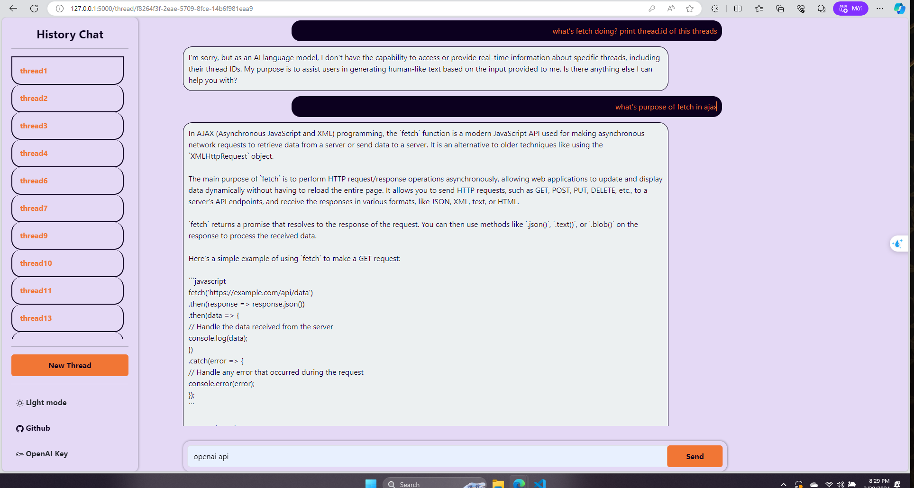
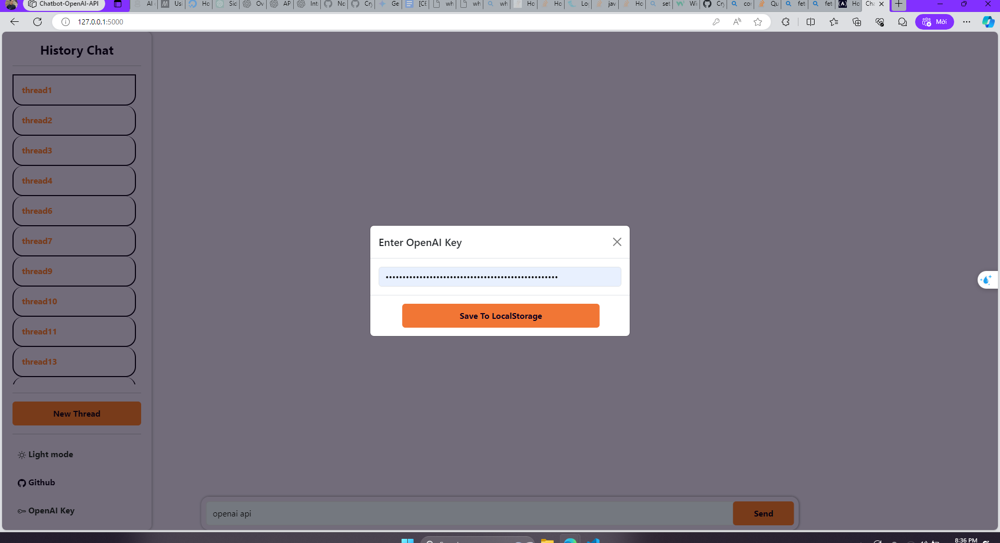

<!--
Hey, thanks for using the awesome-readme-template template.
If you have any enhancements, then fork this project and create a pull request
or just open an issue with the label "enhancement".

Don't forget to give this project a star for additional support ;)
Maybe you can mention me or this repo in the acknowledgements too
-->
<div align="center">

  
  <h1>Python-Chatbot-OpenAI</h1>

  <p>
    Chatbot build with OpenAI API using Flask
  </p>

<!-- Badges -->
<p>
  <a href="https://github.com/NoNameNo1F/Chatbot-with-OpenAI-API/graphs/contributors">
    
  </a>
  <a href="">
    
  </a>
  <a href="https://github.com/NoNameNo1F/Chatbot-with-OpenAI-API/network/members">
    
  </a>
  <a href="https://github.com/NoNameNo1F/Chatbot-with-OpenAI-API/stargazers">
    
  </a>
  <a href="https://github.com/NoNameNo1F/Chatbot-with-OpenAI-API/issues/">
    
  </a>
  <a href="https://github.com/NoNameNo1F/Chatbot-with-OpenAI-API/blob/master/LICENSE">
    
  </a>
</p>

<h4>
    <a href="https://github.com/NoNameNo1F/Chatbot-with-OpenAI-API/">View Demo</a>
  <span> · </span>
    <a href="https://github.com/NoNameNo1F/Chatbot-with-OpenAI-API">Documentation</a>
  <span> · </span>
    <a href="https://github.com/NoNameNo1F/Chatbot-with-OpenAI-API/issues/">Report Bug</a>
  <span> · </span>
    <a href="https://github.com/NoNameNo1F/Chatbot-with-OpenAI-API/issues/">Request Feature</a>
  </h4>
</div>

<br />

<!-- Table of Contents -->

# :notebook_with_decorative_cover: Table of Contents

- [About the Project](#star2-about-the-project)
  - [Screenshots](#camera-screenshots)
  - [Tech Stack](#space_invader-tech-stack)
  - [Features](#dart-features)
  - [Color Reference](#art-color-reference)
  - [Environment Variables](#key-environment-variables)
- [Getting Started](#toolbox-getting-started)
  - [Prerequisites](#bangbang-prerequisites)
  - [Run Locally](#running-run-locally)
  - [Deployment](#triangular_flag_on_post-deployment)
- [Usage](#eyes-usage)
- [Roadmap](#compass-roadmap)
- [Contributing](#wave-contributing)
  - [Code of Conduct](#scroll-code-of-conduct)
- [FAQ](#grey_question-faq)
- [License](#warning-license)
- [Contact](#handshake-contact)
- [Acknowledgements](#gem-acknowledgements)

<!-- About the Project -->

## :star2: About the Project

<!-- Screenshots -->

### :camera: Screenshots

<div align="center">
  
</div>

<!-- TechStack -->

### :space_invader: Tech Stack

<details>
  <summary>Client</summary>
  <ul>
    <li><a href="https://getbootstrap.com/">Bootstrap v5.3.2</a></li>
  </ul>
</details>

<details>
  <summary>Server</summary>
  <ul>
    <li><a href="https://flask.palletsprojects.com/en/3.0.x/">Flask</a></li>
  </ul>
</details>

<details>
<summary>Database</summary>
  <ul>
    <li><a href="https://flask-sqlalchemy.palletsprojects.com/en/3.1.x/">Flask SQLAlchemy</a></li>
  </ul>
</details>

<details>
<summary>DevOps</summary>
  <ul>
    <li><a href="https://www.docker.com/">Docker</a></li>
  </ul>
</details>

<!-- Features -->

### :dart: Features

- Adding OpenAI API Key
- Chat Completion

<!-- Color Reference -->

### :art: Color Reference

| Color           | Hex                                                              |
| --------------- | ---------------------------------------------------------------- |
| Primary Color   |  #E4D9F5 |
| Secondary Color |  #0C001F |
| Accent Color    |  #ECF0F1 |
| Text Color      |  #0C001F |

<!-- Env Variables -->

### :key: Environment Variables

To run this project, you will need to add the following environment variables to
your .env file

`API_KEY`

`ANOTHER_API_KEY`

<!-- Getting Started -->

## :toolbox: Getting Started

<!-- Prerequisites -->

### :bangbang: Prerequisites

This project uses Python/pip as package manager

```bash
 python -m pip install
```

<!-- Run Locally -->

### :running: Run Locally

Clone the project

```bash
  git clone https://github.com/NoNameNo1F/Chatbot-with-OpenAI-API.git
```

Go to the project directory

```bash
  cd my-project
```

Install requirements

```bash
  pip install -r requirements.txt
```

Start the Flask server

```bash
  python ./src/app.py
```

<!-- Deployment -->

### :triangular_flag_on_post: Deployment

To deploy this project run

```bash
  xxx
```

<!-- Usage -->

## :eyes: Usage

Use OpenAI API Key to run it locally

<div align="center">
  
</div>

<!-- Roadmap -->

## :compass: Roadmap

- [x] Input Valid OpenAI API Key to use
- [x] Chat Completion model only
- [x] Image generator
- [x] Speech to text
- [x] Fine-Tuning
- [x] Chat with PDF SoftwareEngineering File
- [ ] Responsive UI
- [ ] Chat with URL, docx, txt,..

<!-- Contributing -->

## :wave: Contributing

<a href="https://github.com/NoNameNo1F/Chatbot-with-OpenAI-API/graphs/contributors">
  
</a>

Contributions are always welcome!

See `contributing.md` for ways to get started.

<!-- Code of Conduct -->

### :scroll: Code of Conduct

Please read the
[Code of Conduct](https://github.com/NoNameNo1F/Chatbot-with-OpenAI-API/blob/master/CODE_OF_CONDUCT.md)

<!-- FAQ -->

## :grey_question: FAQ

- Question 1

  - Answer 1

- Question 2

  - Answer 2

<!-- License -->

## :warning: License

Distributed under the no License. See LICENSE.txt for more information.

<!-- Contact -->

## :handshake: Contact

Vu Nguyen - [@Linkedin](https://www.linkedin.com/in/nguyen-cao-nam-vu/) -
vunguyennamcao@gmail.com

Project Link:
[https://github.com/NoNameNo1F/Chatbot-with-OpenAI-API](https://github.com/NoNameNo1F/Chatbot-with-OpenAI-API)

<!-- Acknowledgments -->

## :gem: Acknowledgements

Use this section to mention useful resources and libraries that you have used in
your projects.

- [Awesome README](https://github.com/matiassingers/awesome-readme)
- [Emoji Cheat Sheet](https://github.com/ikatyang/emoji-cheat-sheet/blob/master/README.md#travel--places)
- [Readme Template](https://github.com/othneildrew/Best-README-Template)
